# 🌦️ Real-Time Weather Anomaly Detection System

Real-time monitoring and anomaly detection for 14 meteorological stations from the National Observatory of Athens (NOA).

> **Note**: This system now uses a **Dual-Verification Strategy** (Temporal + Spatial) to distinguish between device failures and extreme weather events.

---

## 🧠 Core Logic: Time-Space Dual Verification

This system uses a two-step verification process to minimize false alarms.

```mermaid
flowchart TD
    A[Start Detection] --> B{1. Temporal Check}
    B -- Normal --> C[✅ Ignore]
    B -- Anomalous? --> D{2. Spatial Check}
    D -- Trend Matches Neighbors --> E[🌧️ Weather Event]
    D -- Trend Contradicts Neighbors --> F[🔴 Device Failure]
```



### Step 1: Temporal Detection ("Self-Check")
*   **Question**: "Is the station's current value consistent with its own history?"
*   **Method**: **ARIMA** (AutoRegressive Integrated Moving Average) predicts the next value based on the past 6 hours.
*   **Result**: If the actual value deviates significantly from the prediction, it is flagged as a **Suspect**.

### Step 2: Spatial Verification ("Neighbor-Check")
*   **Question**: "Are neighboring stations behaving similarly?"
*   **Method**: **Pearson Correlation** is calculated between the suspect station and its neighbors (within 100km).
*   **Result**:
    *   **High Correlation (>0.6)**: Neighbors are doing the same thing (e.g., all dropping temp). -> **Ignored as Weather**.
    *   **Low Correlation (<0.3)**: Only this station is acting up. -> **Confirmed as Device Failure**.

---

## 📦 Installation & Requirements

### 1. Environment Setup
It is recommended to use Conda or venv to manage dependencies.

```bash
# Activate your environment
conda activate datagem
```

### 2. Install Dependencies
Install the required Python packages using the provided `requirements.txt`.

```bash
pip install -r requirements.txt
```

**Core Dependencies**:
*   `pandas` & `numpy`: Data manipulation.
*   `sqlite3`: Lightweight database for streaming data.
*   `statsmodels`: For ARIMA and Time Series analysis.
*   `scikit-learn`: For Isolation Forest and other ML models.
*   `folium`: For map visualization.

---

## 🌊 System Architecture

### 1. Data Flow (Streaming)
The system follows a **Pull-Based Streaming Architecture**:

1.  **Ingest (`streaming_collector_sqlite.py`)**: 
    *   Runs as a background service (daemon).
    *   Fetches GeoJSON data from NOA API **every 10 minutes**.
    *   Parses and saves data into the local `weather_stream.db`.

2.  **Detect (`anomaly_detector.py`)**:
    *   Triggered on-demand or via cron/scheduler.
    *   Uses a **Sliding Window** mechanism to fetch only relevant history (e.g., last 6 hours).
    *   **Why Sliding Window?** It ensures constant memory usage (O(1)) regardless of database size and provides real-time responsiveness.

### 2. Database Schema
Data is stored in a single optimized SQLite table `observations`.

```sql
CREATE TABLE observations (
    time TIMESTAMP,          -- Observation time
    station_id TEXT,         -- Unique station identifier
    temp_out REAL,           -- Temperature
    out_hum REAL,            -- Humidity
    wind_speed REAL,         -- Wind Speed
    bar REAL,                -- Pressure
    rain REAL,               -- Rain
    PRIMARY KEY (time, station_id)
);
```

---

## 📊 Data Sample

A glimpse of the real-time weather data collected from the stations.

| time | station_id | temp_out (°C) | out_hum (%) | wind_speed (km/h) | bar (hPa) | rain (mm) |
| :--- | :--- | :--- | :--- | :--- | :--- | :--- |
| 2025-11-22 17:00:00 | uth_volos | 10.1 | 85 | 12.5 | 1013.2 | 0.0 |
| 2025-11-22 17:00:00 | volos | 10.4 | 83 | 10.8 | 1013.5 | 0.0 |
| 2025-11-22 17:00:00 | zagora | 8.2 | 91 | 15.2 | 985.4 | 0.2 |
| 2025-11-22 16:50:00 | uth_volos | 10.3 | 84 | 11.9 | 1013.1 | 0.0 |
| 2025-11-22 16:50:00 | volos | 10.6 | 82 | 10.5 | 1013.4 | 0.0 |

**Key Variables**:
*   **`temp_out`**: Outdoor Temperature (Primary indicator for weather events)
*   **`out_hum`**: Outdoor Humidity
*   **`wind_speed`**: Wind Speed (Often fluctuates, triggers anomalies easily)
*   **`bar`**: Barometric Pressure (Useful for detecting storms)
*   **`rain`**: Rainfall rate

---

## 🗺️ Station Network Visualization

Understanding the spatial relationships between stations is crucial for the dual-verification strategy.

👉 **[Interactive Map: View Station Neighbors](https://datagems-eosc.github.io/real-time-anomaly-detection/spatial_network_map.html)**

*   **Blue Dots**: Weather stations.
*   **Red Lines**: Connect stations that are considered "neighbors" (within 100km).
*   **Logic**: If Station A is anomalous, the system checks these connected neighbors for verification.

---

## 🔬 Supported Detection Methods

### 1. Temporal Methods (Time Dimension)
Used in **Step 1** to detect if a single station is behaving abnormally compared to its past.

| Method | Description | Best For |
| :--- | :--- | :--- |
| **`arima`** | AutoRegressive Integrated Moving Average | **Complex Trends** (Weather, Stocks). Best overall accuracy. |
| **`3sigma`** | 3-Sigma Rule (Z-Score) | **Extreme Outliers**. Simple and fast, assuming normal distribution. |
| **`mad`** | Median Absolute Deviation | **Robustness**. Ignores outliers better than 3sigma, but sensitive to flat lines. |
| **`iqr`** | Interquartile Range | **Boxplot Logic**. Good for exploratory analysis. |
| **`isolation_forest`** | Isolation Forest (ML) | **Multidimensional**. Can find subtle anomalies in high-dimensional space. |
| **`stl`** | Seasonal-Trend Decomposition | **Seasonality**. If data has strong daily/weekly cycles. |
| **`lof`** | Local Outlier Factor | **Density**. Finding outliers in clusters. |

### 2. Spatial Methods (Space Dimension)
Used in **Step 2** to verify if the anomaly is isolated or widespread.

| Method | Description | Logic |
| :--- | :--- | :--- |
| **`pearson`** | Pearson Correlation (Trend) | Checks if neighbor trends match (`>0.6` = Match, `<0.3` = Mismatch). |
| **`distance`** | Euclidean/Haversine Distance | Checks value magnitude difference (Static snapshot comparison). |

---

## 🚀 Usage Guide

### 1. Command Input

**Basic Syntax**:
```bash
python anomaly_detector.py --end "TIMESTAMP" --window HOURS --temporal-method METHOD --spatial-verify
```

**Example Command**:
```bash
python anomaly_detector.py \
  --end "2025-11-22 17:00:00" \
  --window 6 \
  --temporal-method arima \
  --spatial-verify
```

| Argument | Description | Recommended Value |
| :--- | :--- | :--- |
| `--end` | The target timestamp to detect | `"NOW"` or specific time (e.g., `"2025-11-22 17:00:00"`) |
| `--window` | Length of historical data to analyze (hours) | `6` |
| `--temporal-method` | Algorithm for Step 1 (Temporal) | `arima` (best) or `3sigma` |
| `--spatial-verify` | **Enable Step 2 (Spatial Verification)** | Always include this flag |
| `--save` | Save report to JSON file | Optional |

---

### 2. Output Explanation

The system prints a human-readable report to the console.

#### A. Summary Section
Quickly see if any *real* action is needed.

```text
Total Stations: 14
Anomalous Stations: 1
Normal Stations: 13

Anomaly Breakdown:
  🔴 Device Failures: 0      <-- CHECK THIS (Real Hardware Issues)
  🌧️ Weather Events: 1       <-- IGNORE THIS (Just Weather)
  ⚠️ Suspected:      0       <-- MANUAL CHECK (Uncertain Cases)
```

#### B. Detailed Report Section
Shows exactly *why* a station was flagged.

```text
[ STATION: uth_volos (Volos - University) ]
  ⚠️  Temperature Anomaly:
      Method: arima
      Expected: 12.5°C | Actual: 10.1°C
      • 2025-11-22 17:00:00: 10.10°C -> 🌧️ Extreme Weather / Env Change
        └─ Diag: Trend Consistent (Corr: 0.85, 3 neighbors)
```

*   **Method**: Which temporal algorithm flagged it (`arima`).
*   **Expected/Actual**: The deviation magnitude.
*   **Arrow (`->`)**: The final classification after Spatial Verification.
    *   `🌧️ Extreme Weather`: Because `Trend Consistent` (Correlation 0.85 > 0.6).
    *   `🔴 Device Failure`: If it had said `Trend Inconsistent` (Correlation < 0.3).

---

## 📁 Project Structure

```text
stream_detection/
├── anomaly_detector.py            # [CORE] Main detection engine (Temporal + Spatial)
├── streaming_collector_sqlite.py  # [CORE] Real-time data collector
├── weather_stream.db              # [DATA] SQLite database storing all history
├── manage_collector.sh            # [OPS] Service management script (start/stop)
│
├── view_data.py                   # [TOOL] Query and export DB data
├── spatial_network_map.html       # [VISUALIZATION] Station network map
└── README.md                      # Documentation
```

---

## 🔍 Troubleshooting

**Q: Why does MAD report so many anomalies?**
A: MAD is very sensitive to small deviations in stable weather. Use **ARIMA** for better trend handling.

**Q: What does "Trend Skipped: no_neighbors" mean?**
A: The station is geographically isolated (no neighbors within 100km). Spatial verification cannot be performed, so the result relies solely on temporal detection.

**Q: How to check neighbors' data manually?**
A: The console output automatically prints a data table for the target station and its neighbors when an anomaly is detected.
