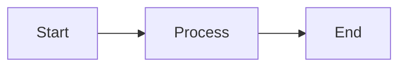

# Documentation README

## Overview

This project now includes professional MkDocs-based documentation following the **DataGEMS Dataset Profiler** documentation style.

## Quick Start

### 1. Install Dependencies

```bash
pip install -r docs_requirements.txt
```

### 2. Preview Documentation Locally

```bash
mkdocs serve
```

Open http://127.0.0.1:8000 in your browser.

### 3. Build Documentation

```bash
mkdocs build
```

Static HTML will be generated in the `site/` directory.

### 4. Deploy to GitHub Pages

```bash
mkdocs gh-deploy
```

## Documentation Structure

```
stream_detection/
├── mkdocs.yml                  # MkDocs configuration
├── docs/                       # Documentation source
│   ├── index.md               # Homepage
│   ├── overview/              # Feature overview
│   ├── system/                # Architecture & methods
│   ├── api/                   # API reference
│   ├── setup/                 # Installation & deployment
│   ├── examples/              # Usage examples
│   ├── faq.md                 # FAQ
│   ├── license.md             # License info
│   ├── assets/                # Images and resources
│   └── stylesheets/           # Custom CSS
├── docs_requirements.txt      # Documentation dependencies
├── DOCS_DEPLOYMENT.md         # Deployment guide
└── DOCS_README.md             # This file
```

## Key Features

### Professional Layout

- ✅ Multi-page navigation structure
- ✅ Material Design theme
- ✅ Search functionality
- ✅ Dark/light mode toggle
- ✅ Mobile-responsive

### Rich Content

- ✅ Mermaid diagrams
- ✅ Code syntax highlighting
- ✅ Tabbed content
- ✅ Admonitions (notes, warnings, tips)
- ✅ Tables and lists

### Developer-Friendly

- ✅ Live reload during development
- ✅ Fast build times
- ✅ Easy deployment to GitHub Pages
- ✅ Version control friendly (Markdown)

## Content Overview

### [Homepage](docs/index.md)
Introduction to the Real-Time Anomaly Detection system with quick start guide.

### [Overview](docs/overview/)
- **Features**: Key features and capabilities
- **How It Works**: Step-by-step explanation of the dual-verification strategy

### [System](docs/system/)
- **Architecture**: System components and data flow
- **Detection Methods**: Detailed comparison of all 7 detection algorithms
- **Station Network**: Interactive map and neighbor relationships

### [API](docs/api/)
- **Overview**: Command-line interface basics
- **Parameters**: Complete parameter reference
- **Response Format**: Output structure and parsing
- **Examples**: 18 real-world usage examples

### [Setup & Monitoring](docs/setup/)
- **Installation**: Step-by-step installation guide
- **Configuration**: Tuning and optimization
- **Deployment**: Production deployment options (systemd, Docker, K8s)
- **Database**: SQLite vs TimescaleDB comparison and migration

### [Examples](docs/examples/)
- **Weather Event**: Cold front case study with high correlation
- **Device Failure**: Sensor malfunction with low correlation

### [FAQ](docs/faq.md)
60+ frequently asked questions covering installation, configuration, troubleshooting, and best practices.

### [License](docs/license.md)
Project license and attribution information.

## Comparison: Old vs New Documentation

| Aspect | Original README | New MkDocs |
|--------|----------------|------------|
| **Format** | Single Markdown file | Multi-page website |
| **Navigation** | Manual scrolling | Sidebar navigation |
| **Search** | Ctrl+F only | Full-text search |
| **Structure** | Linear | Hierarchical |
| **Diagrams** | Basic Mermaid | Full Mermaid support + styling |
| **Code Highlighting** | Basic | Language-specific |
| **Mobile** | Readable | Optimized |
| **Maintenance** | All in one file | Organized by topic |
| **Professional** | Good | Excellent |

## Migration Notes

### What's Changed

1. **Original `README.md` is preserved** - You can keep using it
2. **New documentation structure** - Professional multi-page docs
3. **Content reorganized** - Easier to find information
4. **Enhanced with examples** - More real-world scenarios
5. **Professional styling** - Matches DataGEMS platform

### What's New

- 📚 **18 API examples** (vs 5 in original)
- 📊 **2 detailed case studies** (weather event & device failure)
- ⚙️ **4 deployment options** (systemd, Docker, K8s, cron)
- 🔧 **60+ FAQ entries** (vs ~10 in original)
- 🗺️ **Station network documentation** with interactive map
- 📈 **Performance comparisons** for all detection methods

## Updating Documentation

### Add a New Page

1. Create a new `.md` file in `docs/`
2. Add to navigation in `mkdocs.yml`:

```yaml
nav:
  - Your Section:
    - New Page: path/to/new-page.md
```

### Edit Existing Page

1. Edit the `.md` file in `docs/`
2. Changes automatically reload if `mkdocs serve` is running

### Add Images

1. Place image in `docs/assets/`
2. Reference in markdown: ``

### Add Mermaid Diagrams

````markdown

````

## Deployment Options

### GitHub Pages (Recommended)

```bash
mkdocs gh-deploy
```

Docs will be live at: `https://username.github.io/repo-name/`

### Read the Docs

1. Connect repository to readthedocs.org
2. Automatic deployment on every push

### Self-Hosted

```bash
mkdocs build
# Deploy site/ directory to any web server
```

See [DOCS_DEPLOYMENT.md](DOCS_DEPLOYMENT.md) for detailed instructions.

## Development Workflow

```bash
# 1. Make changes to docs/*.md files
vim docs/api/overview.md

# 2. Preview locally
mkdocs serve

# 3. Test in browser
open http://127.0.0.1:8000

# 4. Build and check for errors
mkdocs build

# 5. Deploy
mkdocs gh-deploy
```

## Customization

### Change Colors

Edit `mkdocs.yml`:

```yaml
theme:
  palette:
    primary: blue     # Change to: red, pink, purple, indigo, etc.
    accent: light blue
```

### Add Custom CSS

Edit `docs/stylesheets/extra.css`

### Change Logo

Replace `docs/assets/logo.png` and update `mkdocs.yml`

## Troubleshooting

### Documentation not updating?

```bash
# Clear build cache
rm -rf site/
mkdocs build
```

### Mermaid diagrams not showing?

```bash
# Ensure plugin is installed
pip install mkdocs-mermaid2-plugin
```

### GitHub Pages 404?

1. Check GitHub repo settings → Pages
2. Ensure source is set to `gh-pages` branch
3. Wait 5-10 minutes for deployment

## Resources

- **MkDocs**: https://www.mkdocs.org
- **Material Theme**: https://squidfunk.github.io/mkdocs-material/
- **Markdown Guide**: https://www.markdownguide.org
- **Mermaid**: https://mermaid.js.org

## Contributing

When contributing documentation:

1. Follow the existing structure
2. Use clear, concise language
3. Add code examples where helpful
4. Test locally before committing
5. Update navigation in `mkdocs.yml` if adding new pages

## Questions?

- Check [DOCS_DEPLOYMENT.md](DOCS_DEPLOYMENT.md) for deployment help
- Check [docs/faq.md](docs/faq.md) for usage questions
- Open a GitHub issue for bugs or suggestions

---

**Enjoy the new professional documentation! 🎉**

