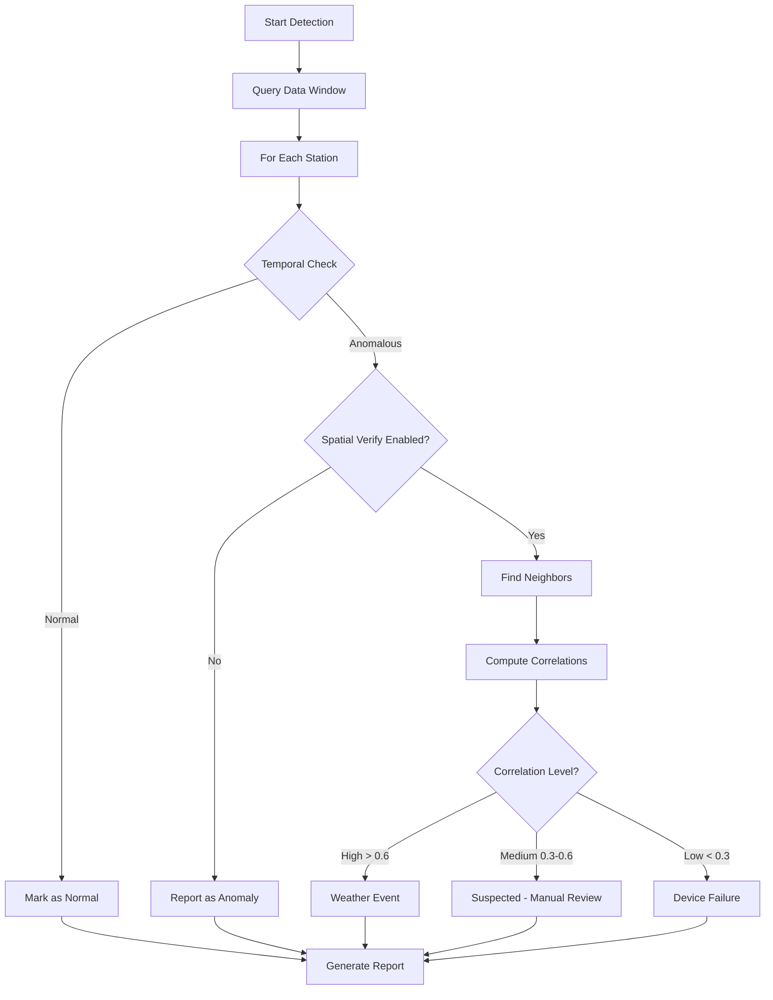
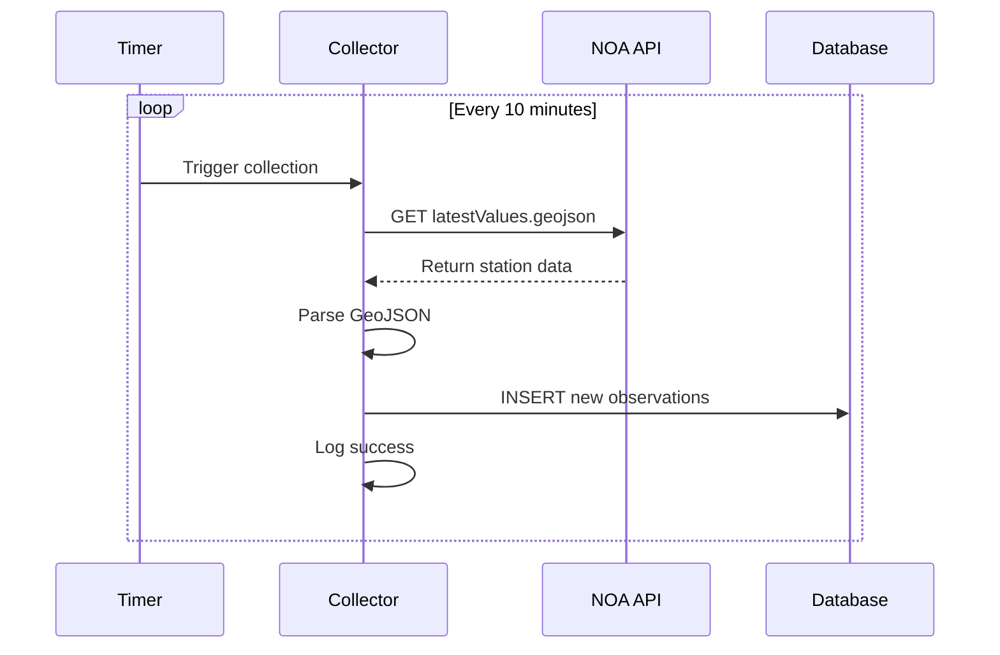
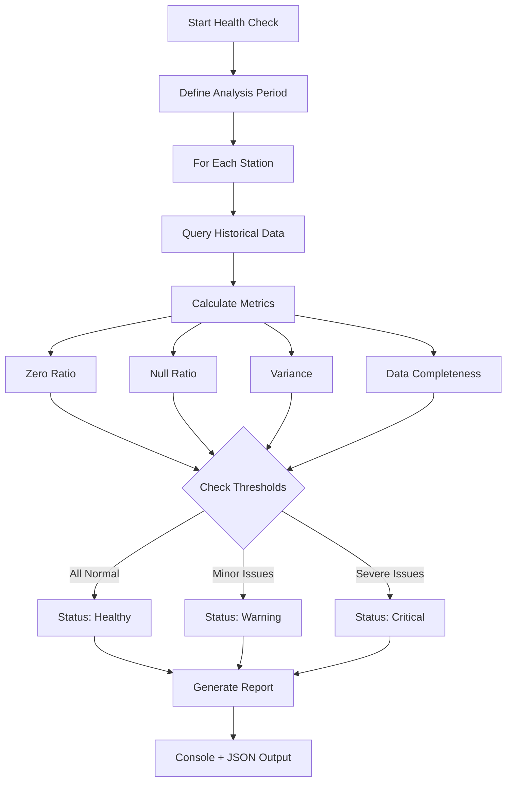

# How It Works

## Detection Modes

The system provides two complementary detection modes:

### Mode 1: Short-Term Detection (Hours)
Real-time anomaly detection using temporal + spatial verification to catch sudden failures.

### Mode 2: Long-Term Health Check (Days/Weeks) 
Sensor health monitoring to identify chronic problems like stalled sensors and data loss.

---

## Short-Term Detection Workflow



## Step 1: Temporal Detection

### Purpose

Identify if a station's current reading deviates significantly from its own historical pattern.

### Process

1. **Query Historical Window**: Retrieve the last N hours of data for the station (default: 6 hours)
2. **Fit Model**: Train a time series model (e.g., ARIMA) on the historical data
3. **Predict Expected Value**: Generate a forecast for the current timestamp
4. **Calculate Deviation**: Compare actual vs. predicted value
5. **Flag Anomaly**: If deviation exceeds threshold, mark as suspect

### Example: ARIMA Detection

```python
# Simplified example
historical_data = query_window(station_id, hours=6)
model = ARIMA(historical_data, order=(1,1,1))
fitted_model = model.fit()

predicted = fitted_model.forecast(steps=1)
actual = get_current_value(station_id)

if abs(actual - predicted) > threshold:
    flag_as_anomaly(station_id, variable)
```

### Why Different Methods?

Different algorithms work better for different scenarios:

- **ARIMA**: Best for data with trends and seasonality (weather)
- **3-Sigma**: Fast baseline for normally distributed data
- **MAD**: Robust when data contains outliers
- **Isolation Forest**: Effective for multidimensional patterns

## Step 2: Spatial Verification

### Purpose

Determine if the anomaly is localized (device failure) or widespread (weather event).

### Process

1. **Find Neighbors**: Query all stations within 100km radius
2. **Retrieve Neighbor Data**: Get the same time window for all neighbors
3. **Handle Missing Data**: Interpolate gaps to ensure robust comparison
4. **Compute Trend Correlation**: Calculate Pearson correlation on the past 6 hours
5. **Classify Anomaly**:
   - High correlation (> 0.6): Neighbors show same trend → Weather event
   - Low correlation (< 0.3): Only this station is anomalous → Device failure
   - Medium correlation (0.3-0.6): Uncertain → Requires manual review

### Example Scenarios

#### Scenario A: Extreme Weather Event

```
Station A: Temperature drops from 15°C to 5°C (flagged)
Station B (50km away): Temperature drops from 16°C to 6°C
Station C (80km away): Temperature drops from 14°C to 4°C

→ High correlation (0.85)
→ Classification: Weather Event (Ignore)
```

#### Scenario B: Device Failure

```
Station A: Temperature shows 99°C (flagged)
Station B (50km away): Temperature stable at 15°C
Station C (80km away): Temperature stable at 14°C

→ Low correlation (0.05)
→ Classification: Device Failure (Alert!)
```

### Why Pearson Correlation?

Pearson correlation measures **trend consistency**, not absolute value similarity:

- Two stations can have different base temperatures but move together
- Example: Station A at 10°C drops to 8°C, Station B at 15°C drops to 13°C
  → Both drop by 2°C → High correlation

## Data Collection Pipeline

### Collector Daemon



### Database Storage

Data is stored with a composite primary key to ensure uniqueness:

```sql
CREATE TABLE observations (
    time TIMESTAMP,
    station_id TEXT,
    temp_out REAL,
    out_hum REAL,
    wind_speed REAL,
    bar REAL,
    rain REAL,
    PRIMARY KEY (time, station_id)
);

-- Optimized index for time-range queries
CREATE INDEX idx_time ON observations(time DESC);
```

## Sliding Window Mechanism

### Why Sliding Windows?

Traditional batch processing loads all historical data into memory:

- **Problem**: Memory usage grows linearly with data size
- **Result**: System becomes slower over time

Sliding windows only load the relevant time range:

- **Advantage**: Constant memory usage O(1)
- **Result**: Performance remains stable regardless of database size

### Window Parameters

| Parameter | Default | Description |
|-----------|---------|-------------|
| Window Size | 6 hours | Amount of historical data to analyze |
| Stride | 10 minutes | How far the window moves forward |
| End Time | NOW | The current timestamp to detect |

### Visualization

```
Timeline:  [...............|======WINDOW======|*]
                          6h ago          NOW (*)
                                          ↓
                                    Detection Point

Each window:
- Analyzes data from [NOW-6h] to [NOW]
- Predicts value at NOW
- Compares with actual value at NOW
```

## Output Format

### Console Report

```
═══════════════════════════════════════════════
 ANOMALY DETECTION REPORT
═══════════════════════════════════════════════

Total Stations: 14
Anomalous Stations: 1
Normal Stations: 13

Anomaly Breakdown:
  🔴 Device Failures: 1      <- Action required
  🌧️ Weather Events: 0       <- No action needed
  ⚠️ Suspected: 0            <- Manual review

[ STATION: uth_volos ]
  🔴 Temperature Anomaly:
      Method: arima
      Expected: 12.5°C | Actual: 25.8°C
      • 2025-11-22 17:00:00: 25.80°C -> 🔴 Device Failure
        └─ Diag: Trend Inconsistent (Corr: 0.12, 3 neighbors)
```

### JSON Report (Optional)

```json
{
  "timestamp": "2025-11-22T17:00:00Z",
  "total_stations": 14,
  "anomalous_stations": 1,
  "device_failures": 1,
  "weather_events": 0,
  "suspected": 0,
  "details": [
    {
      "station_id": "uth_volos",
      "variable": "temp_out",
      "method": "arima",
      "expected": 12.5,
      "actual": 25.8,
      "classification": "device_failure",
      "spatial_correlation": 0.12,
      "neighbors_checked": 3
    }
  ]
}
```

## Long-Term Health Check Workflow 🆕



### Process Details

1. **Define Analysis Period**: Specify time window (e.g., 7 or 30 days)
2. **Query Historical Data**: Retrieve all observations for the period
3. **Calculate Health Metrics**:
   - **Zero Ratio**: Count zero readings / total valid readings
   - **Null Ratio**: Count missing data / expected observations
   - **Variance**: Statistical measure of data variability
   - **Completeness**: Actual observations / expected observations
4. **Apply Thresholds**:
   - Zero ratio > 30% → Warning
   - Zero ratio > 50% → Critical
   - Null ratio > 50% → Critical
   - Variance < 0.1 → Warning (for variables that should fluctuate)
5. **Classify Overall Status**:
   - Healthy: No issues
   - Warning: Minor problems
   - Critical: Severe problems requiring immediate action
6. **Generate Report**: Export console summary and JSON details

### Example Health Check Process

```python
# Simplified pseudocode
def check_station_health(station_id, days=7):
    # Step 1: Query data
    data = query_data(station_id, days)
    
    # Step 2: Calculate metrics
    zero_ratio = count_zeros(data) / len(data)
    null_ratio = count_nulls(data) / expected_count(days)
    variance = calculate_variance(data)
    completeness = len(data) / expected_count(days)
    
    # Step 3: Apply thresholds
    issues = []
    if zero_ratio > 0.3:
        issues.append(f"High zero ratio ({zero_ratio:.1%})")
    if null_ratio > 0.5:
        issues.append(f"High data loss ({null_ratio:.1%})")
    if variance < 0.1:
        issues.append("Low variance - sensor may be stuck")
    
    # Step 4: Determine status
    if any(critical_issue in issues for critical_issue in ["zero ratio", "data loss"]):
        status = "critical"
    elif len(issues) > 0:
        status = "warning"
    else:
        status = "healthy"
    
    return {
        "station_id": station_id,
        "status": status,
        "completeness": completeness,
        "issues": issues,
        "metrics": {
            "zero_ratio": zero_ratio,
            "null_ratio": null_ratio,
            "variance": variance
        }
    }
```

---

## Performance Characteristics

### Short-Term Detection

| Metric | Value | Notes |
|--------|-------|-------|
| Detection Latency | < 1 minute | For 14 stations with ARIMA |
| Memory Usage | ~200MB | Constant regardless of DB size |
| Database Size | ~10MB/month | For 14 stations at 10-min intervals |
| Scalability | Linear | Scales with number of stations, not time |

### Long-Term Health Check

| Metric | Value | Notes |
|--------|-------|-------|
| Analysis Time | ~5-10 seconds | For 14 stations, 7-day period |
| Memory Usage | ~100MB | Loads aggregate statistics only |
| Report Size | ~50KB JSON | Detailed metrics per station |
| Scalability | Linear | O(n) where n = number of stations |

