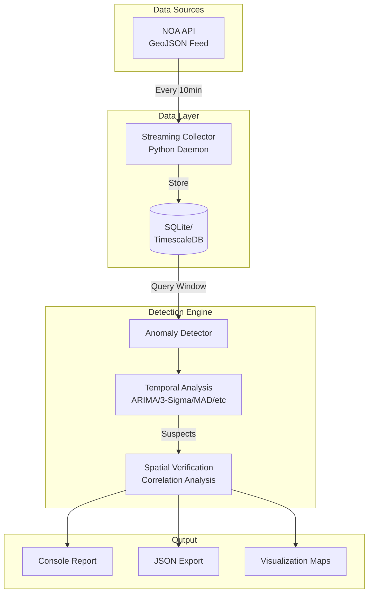

# System Architecture

## High-Level Architecture



## Component Details

### 1. Data Collection Layer

#### Streaming Collector (`streaming_collector_sqlite.py`)

**Purpose**: Continuously fetch and store meteorological data from NOA API.

**Key Features**:

- Runs as a background daemon (systemd service compatible)
- Fetches data every 10 minutes
- Handles network failures gracefully with retry logic
- Parses GeoJSON format from NOA API
- Stores data with timestamp normalization

**Architecture Pattern**: Pull-based streaming

```python
# Pseudo-code
while True:
    try:
        data = fetch_geojson(NOA_API_URL)
        observations = parse_geojson(data)
        store_to_database(observations)
        log_success()
        sleep(600)  # 10 minutes
    except Exception as e:
        log_error(e)
        sleep(60)   # Retry in 1 minute
```

**Management**:

```bash
# Start collector
./manage_collector.sh start

# Stop collector
./manage_collector.sh stop

# Check status
./manage_collector.sh status
```

### 2. Storage Layer

#### Database Schema

The system uses a single optimized table for time-series storage:

```sql
CREATE TABLE observations (
    time TIMESTAMP NOT NULL,
    station_id TEXT NOT NULL,
    temp_out REAL,
    out_hum REAL,
    wind_speed REAL,
    bar REAL,
    rain REAL,
    PRIMARY KEY (time, station_id)
);

-- Performance index
CREATE INDEX idx_time ON observations(time DESC);
CREATE INDEX idx_station_time ON observations(station_id, time DESC);
```

#### Storage Options

=== "SQLite (Default)"

    **Use Case**: Standalone deployment, development, testing

    **Advantages**:
    
    - No external dependencies
    - Single-file database
    - Zero configuration
    - Embedded in Python
    
    **Limitations**:
    
    - Single-writer (but sufficient for this use case)
    - File-based (local disk only)
    
    **Performance**:
    
    - Query Time: < 100ms for 6-hour window
    - Storage: ~10MB per month (14 stations)
    - Max Scale: ~100 stations

=== "TimescaleDB (Enterprise)"

    **Use Case**: Production deployment, multiple collectors, advanced analytics

    **Advantages**:
    
    - Automatic time-based partitioning (hypertables)
    - Distributed queries
    - Advanced compression
    - Continuous aggregates
    
    **Configuration**:
    
    ```sql
    -- Convert table to hypertable
    SELECT create_hypertable('observations', 'time');
    
    -- Enable compression (optional)
    ALTER TABLE observations SET (
        timescaledb.compress,
        timescaledb.compress_segmentby = 'station_id'
    );
    ```
    
    **Performance**:
    
    - Query Time: < 50ms for 6-hour window
    - Storage: ~3MB per month with compression
    - Max Scale: 10,000+ stations

### 3. Detection Engine

#### Main Detector (`anomaly_detector.py`)

**Purpose**: Orchestrates temporal detection and spatial verification.

**Workflow**:

```python
class AnomalyDetector:
    def detect(self, end_time, window_hours, method, spatial_verify):
        # 1. Query data window
        data = self.query_window(end_time, window_hours)
        
        # 2. Temporal detection for each station
        suspects = []
        for station in self.stations:
            if self.temporal_detector.is_anomalous(station, data):
                suspects.append(station)
        
        # 3. Spatial verification (if enabled)
        if spatial_verify:
            for suspect in suspects:
                neighbors = self.find_neighbors(suspect)
                correlation = self.compute_correlation(suspect, neighbors)
                classification = self.classify(correlation)
                suspect.classification = classification
        
        # 4. Generate report
        return self.generate_report(suspects)
```

#### Temporal Detectors

Each detection method implements a common interface:

```python
class TemporalDetector:
    def is_anomalous(self, station_data, variable):
        """
        Returns True if the latest value is anomalous.
        """
        pass
```

**Supported Methods**:

| Method | Implementation | Threshold |
|--------|----------------|-----------|
| ARIMA | `statsmodels.tsa.arima.model.ARIMA` | Forecast confidence interval |
| 3-Sigma | Z-score: `(x - μ) / σ > 3` | 3 standard deviations |
| MAD | `abs(x - median) / MAD > 3.5` | 3.5 MAD units |
| IQR | `x < Q1 - 1.5*IQR or x > Q3 + 1.5*IQR` | 1.5 IQR |
| Isolation Forest | `sklearn.ensemble.IsolationForest` | Contamination = 0.1 |
| STL | Seasonal decomposition residuals | 3 sigma on residuals |
| LOF | `sklearn.neighbors.LocalOutlierFactor` | Negative outlier factor |

#### Spatial Verifier

**Purpose**: Compare suspect station with neighbors to classify anomaly type.

**Algorithm**:

```python
def verify_spatial(suspect_station, window_hours):
    # 1. Find neighbors within 100km
    neighbors = find_neighbors(suspect_station, radius_km=100)
    
    # 2. Get time series for all
    suspect_series = get_series(suspect_station, window_hours)
    neighbor_series = [get_series(n, window_hours) for n in neighbors]
    
    # 3. Interpolate missing values
    suspect_series = interpolate(suspect_series)
    neighbor_series = [interpolate(s) for s in neighbor_series]
    
    # 4. Calculate Pearson correlation
    correlations = [pearson(suspect_series, ns) for ns in neighbor_series]
    avg_correlation = mean(correlations)
    
    # 5. Classify
    if avg_correlation > 0.6:
        return "weather_event"
    elif avg_correlation < 0.3:
        return "device_failure"
    else:
        return "suspected"
```

**Interpolation Strategy**:

When neighbor data has missing values:

```python
# Linear interpolation for small gaps (< 3 consecutive points)
series.interpolate(method='linear', limit=3, inplace=True)

# Forward fill for remaining gaps
series.fillna(method='ffill', inplace=True)
```

### 4. Output Layer

#### Console Reporter

Generates human-readable reports with:

- Summary statistics
- Detailed anomaly descriptions
- Spatial verification diagnostics
- Data tables for manual inspection

#### JSON Exporter

Produces structured output for:

- Integration with monitoring systems
- Historical analysis
- Dashboard visualization

#### Map Generator (`generate_map.py`)

Creates interactive HTML maps using Folium:

- Station locations
- Neighbor connections (red lines)
- Metadata tooltips

## Deployment Pattern

### Standalone Server

```
┌─────────────────────────┐
│   Single Server         │
│                         │
│  ┌─────────────────┐   │
│  │ Collector       │   │
│  │ (Background)    │   │
│  └─────────────────┘   │
│          ↓              │
│  ┌─────────────────┐   │
│  │ SQLite DB       │   │
│  └─────────────────┘   │
│          ↓              │
│  ┌─────────────────┐   │
│  │ Detector        │   │
│  │ (On-demand)     │   │
│  └─────────────────┘   │
└─────────────────────────┘
```

**Use Case**: Current implementation for NOA meteorological stations

## Security Considerations

### Data Storage

- Database files have restricted permissions (600)
- No sensitive user data stored
- All data is public meteorological information

### Network

- API calls use HTTPS
- No authentication required (public API)
- Rate limiting respected (1 request per 10 minutes)

### Process Isolation

- Collector runs as limited user
- No root privileges required
- Systemd sandboxing recommended

## Monitoring and Health Checks

### Collector Health

Monitor these indicators:

- Last successful fetch timestamp
- Consecutive failure count
- Network latency to API
- Database write latency

Example health check:

```bash
# Check if collector is running
ps aux | grep streaming_collector

# Check last data timestamp
sqlite3 weather_stream.db \
  "SELECT MAX(time) FROM observations;"

# Check data freshness (should be < 15 minutes)
```

