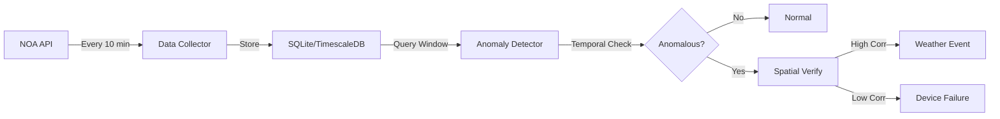

# Real-Time Anomaly Detection


This is the documentation site for the Real-Time Anomaly Detection service. The service is part of the wider DataGEMS platform.

The Real-Time Anomaly Detection service is designed to monitor meteorological stations and distinguish between genuine device failures and extreme weather events using a dual-verification strategy combining temporal and spatial analysis.

## Key Features

- **Dual-Verification Strategy**: Combines temporal self-checks with spatial neighbor verification to minimize false alarms
- **Multi-Method Support**: Includes ARIMA, Z-Score, MAD, IQR, Isolation Forest, STL, and LOF detection methods
- **Real-Time Processing**: Streaming architecture with 10-minute data ingestion intervals
- **Spatial Intelligence**: Automatically detects and correlates anomalies across neighboring stations within 100km radius
- **Scalable Architecture**: Supports both SQLite for standalone deployment and TimescaleDB for enterprise scale
- **Interactive Visualization**: Generates station network maps showing spatial relationships

## How It Works

The Real-Time Anomaly Detection service works through a two-step verification process:

### Step 1: Temporal Detection
Analyzes each station's current readings against its own historical data using time series methods (e.g., ARIMA) to detect deviations from expected patterns.

### Step 2: Spatial Verification
Compares the suspect station's behavior with neighboring stations to determine if the anomaly is:

- **Weather Event**: Neighboring stations show similar patterns (high correlation > 0.6)
- **Device Failure**: Only this station is anomalous (low correlation < 0.3)

### Data Flow



## Target Deployment

The service currently monitors 14 meteorological stations operated by the National Observatory of Athens (NOA), with data updates every 10 minutes from the [NOA DataGEMS Feed](https://stratus.meteo.noa.gr/data/stations/latestValues_Datagems.geojson).

## Quick Start

```bash
# Install dependencies
pip install -r requirements.txt

# Start data collection
./manage_collector.sh start

# Run detection
python anomaly_detector.py \
  --end "NOW" \
  --window 6 \
  --temporal-method arima \
  --spatial-verify
```

For detailed installation instructions, see the [Installation Guide](setup/installation.md).

## Data Format

The service processes five core meteorological variables:

| Variable | Description | Unit |
|----------|-------------|------|
| `temp_out` | Outdoor Temperature | °C |
| `out_hum` | Outdoor Humidity | % |
| `wind_speed` | Wind Speed | km/h |
| `bar` | Barometric Pressure | hPa |
| `rain` | Rainfall Rate | mm |

## Architecture Overview

The system follows a **pull-based streaming architecture**:

- **Collector**: Background daemon fetching data from NOA API every 10 minutes
- **Database**: SQLite for standalone or TimescaleDB for enterprise deployment
- **Detector**: On-demand or scheduled analysis using sliding window mechanism
- **Reporter**: Console and JSON output with detailed anomaly classifications

For more details, see the [Architecture](system/architecture.md) documentation.

## Support

For questions, issues, or contributions:

- **GitHub Issues**: [Report a bug or request a feature](https://github.com/datagems-eosc/real-time-anomaly-detection/issues)
- **Documentation**: Browse this documentation site
- **FAQ**: Check the [Frequently Asked Questions](faq.md)

