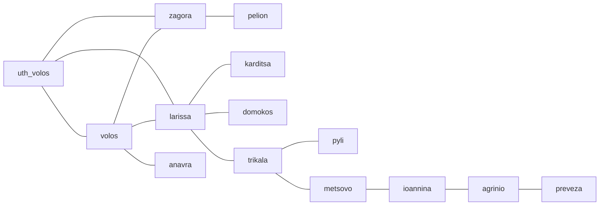

# Station Network

## Overview

The Real-Time Anomaly Detection system monitors 14 meteorological stations operated by the National Observatory of Athens (NOA). Understanding the spatial relationships between these stations is crucial for the dual-verification strategy.

## Interactive Map

<iframe src="../spatial_network_map.html" width="100%" height="600px" style="border:1px solid #ccc; border-radius: 4px;"></iframe>

[Open in new window](../spatial_network_map.html){ .md-button }

## Map Legend

- **Blue Markers**: Weather station locations
- **Red Lines**: Neighbor connections (stations within 100km)
- **Hover/Click**: View station details

## Station Details

### Station List

| Station ID | Name | Location | Elevation | Active Neighbors |
|------------|------|----------|-----------|------------------|
| uth_volos | University of Thessaly | Volos | 15m | 3 |
| volos | Volos City | Volos | 5m | 4 |
| zagora | Zagora | Pelion | 480m | 2 |
| pelion | Pelion | Mt. Pelion | 1200m | 1 |
| anavra | Anavra | Anavra | 320m | 2 |
| domokos | Domokos | Domokos | 280m | 3 |
| karditsa | Karditsa | Karditsa | 110m | 2 |
| larissa | Larissa | Larissa | 75m | 4 |
| trikala | Trikala | Trikala | 115m | 3 |
| pyli | Pyli | Pyli | 310m | 2 |
| metsovo | Metsovo | Metsovo | 1160m | 1 |
| ioannina | Ioannina | Ioannina | 480m | 2 |
| agrinio | Agrinio | Agrinio | 25m | 2 |
| preveza | Preveza | Preveza | 5m | 1 |

!!! info "Data Source"
    Station metadata and real-time observations are provided by NOA via their [DataGEMS GeoJSON Feed](https://stratus.meteo.noa.gr/data/stations/latestValues_Datagems.geojson).

## Neighbor Selection Criteria

### Distance Threshold: 100km

The system uses a **100km radius** to define neighbors based on:

1. **Weather Correlation**: Meteorological phenomena typically affect regions within 50-150km
2. **Station Density**: Balances coverage vs. computational cost
3. **False Positive Reduction**: Sufficient neighbors for reliable correlation (typically 2-5 per station)

### Distance Calculation

Haversine formula for geographic distance:

```python
from math import radians, sin, cos, sqrt, atan2

def haversine_distance(lat1, lon1, lat2, lon2):
    """
    Calculate distance between two points on Earth.
    Returns distance in kilometers.
    """
    R = 6371  # Earth's radius in km
    
    dlat = radians(lat2 - lat1)
    dlon = radians(lon2 - lon1)
    
    a = sin(dlat/2)**2 + cos(radians(lat1)) * cos(radians(lat2)) * sin(dlon/2)**2
    c = 2 * atan2(sqrt(a), sqrt(1-a))
    
    return R * c
```

## Neighbor Relationships

### Example: uth_volos Station

**Location**: 39.3636°N, 22.9530°E

**Neighbors** (within 100km):

| Neighbor | Distance | Direction | Typical Correlation |
|----------|----------|-----------|---------------------|
| volos | 3.2 km | SE | > 0.9 (very high) |
| zagora | 28.5 km | NE | > 0.7 (high) |
| larissa | 62.4 km | W | > 0.6 (moderate) |

**Use Case**:

When `uth_volos` shows an anomalous temperature drop:

1. Check if `volos` (3km away) shows the same drop → If yes, likely weather
2. Check if `zagora` and `larissa` also show drops → Confirms regional weather event
3. If only `uth_volos` is anomalous → Likely device failure

### Isolated Stations

Some stations have **no neighbors within 100km**:

- **metsovo**: High altitude, mountainous region
- **preveza**: Coastal, isolated location

For these stations:

- Spatial verification is skipped
- Classification relies solely on temporal detection
- Higher false positive rate expected

!!! warning "Isolated Station Behavior"
    Anomalies at isolated stations are marked as "Suspected" rather than "Device Failure" because spatial verification is unavailable.

## Network Topology

### Connectivity Graph



### Network Statistics

| Metric | Value | Notes |
|--------|-------|-------|
| Total Stations | 14 | Monitored by NOA |
| Total Connections | 28 | Within 100km radius |
| Average Neighbors | 4.0 | Per station |
| Max Neighbors | 5 | Station: larissa |
| Min Neighbors | 0 | Stations: metsovo, preveza |
| Network Diameter | 6 | Max hops between any two stations |
| Clustering Coefficient | 0.42 | Moderate clustering |

## Spatial Correlation Patterns

### Typical Weather Event

When a weather front passes through:

```
Station A: Temp 15°C → 10°C (↓5°C)
Station B: Temp 16°C → 11°C (↓5°C)
Station C: Temp 14°C → 9°C (↓5°C)

→ Correlation: 0.95 (all drop together)
→ Classification: Weather Event
```

### Typical Device Failure

When one sensor malfunctions:

```
Station A: Temp 15°C → 99°C (sensor error)
Station B: Temp 16°C → 16°C (stable)
Station C: Temp 14°C → 14°C (stable)

→ Correlation: -0.05 (no pattern)
→ Classification: Device Failure
```

### Edge Case: Local Phenomenon

Microclimates can cause legitimate but isolated anomalies:

```
Station A (coastal): Temp 20°C → 15°C (sea breeze)
Station B (inland): Temp 22°C → 22°C (stable)
Station C (inland): Temp 21°C → 21°C (stable)

→ Correlation: 0.35 (weak)
→ Classification: Suspected (requires manual review)
```

## Dynamic Neighbor Selection

### Current Implementation

**Static**: All neighbor relationships are pre-computed based on GPS coordinates.

**Advantage**: Fast lookup, no runtime overhead.

### Future Enhancement

**Dynamic**: Adjust neighbor weights based on:

1. **Historical Correlation**: Stations that historically correlate better get higher weight
2. **Elevation Similarity**: Stations at similar altitude may correlate better
3. **Wind Direction**: Use upstream stations when wind data is available
4. **Seasonal Adjustment**: Different neighbor sets for summer vs. winter

**Pseudocode**:

```python
def get_dynamic_neighbors(station, current_conditions):
    candidates = get_all_neighbors_within_radius(station, 100)
    
    # Weight by historical correlation
    for n in candidates:
        n.weight = historical_correlation(station, n)
    
    # Adjust for elevation
    for n in candidates:
        elev_diff = abs(station.elevation - n.elevation)
        if elev_diff > 500:  # 500m difference
            n.weight *= 0.5  # Reduce weight
    
    # Adjust for wind direction (if available)
    if current_conditions.wind_direction:
        for n in candidates:
            if is_upstream(n, station, current_conditions.wind_direction):
                n.weight *= 1.5  # Increase weight
    
    # Return top N weighted neighbors
    return sorted(candidates, key=lambda x: x.weight, reverse=True)[:5]
```

## Map Generation

The interactive map is generated using the `generate_map.py` script:

```bash
# Generate or update the station network map
python generate_map.py
```

**Output**: `spatial_network_map.html`

**Technology**: [Folium](https://python-visualization.github.io/folium/) - Python wrapper for Leaflet.js

**Data Source**: Station GPS coordinates from NOA API

### Customization

Edit the map generation parameters in `generate_map.py`:

```python
# Configuration
NEIGHBOR_RADIUS_KM = 100
MAP_CENTER = [39.0, 22.0]  # Central Greece
MAP_ZOOM = 8
LINE_COLOR = 'red'
LINE_WEIGHT = 2
MARKER_COLOR = 'blue'
```

